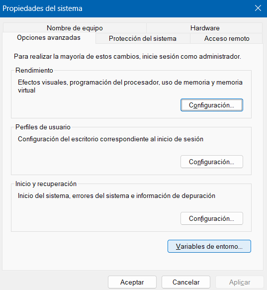
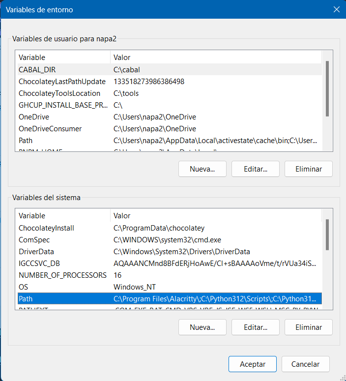

# Navi

Proyecto para la facultad de Nutrición

## Instalación de requisitos
Si ya cuentes con MariDB, composer y PHP, o lo estás utilizando con XAMPP o similar,
omite esto y ve a la siguiente sección.
La configuración aquí presentada es para producción
### Windows
Para instalar los programas, para todos los casos se debe de ir a los enlaces que proporcionan
las mismas páginas
#### Git
Se necesita Git para poder instalar Laravel, para descargar, ir al siguiente link [git/download/win](https://git-scm.com/download/win)
Para la instalación de git se puede seguir el siguiente tutorial [Cómo Instalar Git en Windows 10 en 2024](https://www.youtube.com/watch?v=JWnZvHOYBDc)

#### NodeJS
Otro componente que utiliza Laravel es el administrador de paquete NPM, para poder instalarlo, NodeJS trae
como por defecto este administrador de paquetes (al menos hasta la 20.14), instalar NodeJS
con el siguiente link para descargar [nodejs.org/dist/20.14.0/](https://nodejs.org/dist/v20.14.0/node-v20.14.0-x64.msi)
Para su instalación se puede seguir el siguiente tutorial [como Instalar Node JS en Windows en 2024](https://www.youtube.com/watch?v=29mihvA_zEA)

#### MariaDB
Ir al siguiente enlace para descargar MariaDB
[mariadb.org/download](https://mariadb.org/download/?t=mariadb&p=mariadb&r=11.4.2)
Se deben de seguir las instrucciones del instalador
Enlace a un tutorial para instalar MariaDb [01 - Descarga e Instalación de MariaDB | Curso de Base de Datos MariaDB Server](https://www.youtube.com/watch?v=syYStO_BFgw)

#### PHP
Ir al siguiente enlace para descargar PHP
[php.net/download#php-8.3](https://windows.php.net/download#php-8.3)
Para este enlace, se debe de descargar el PHP Non Thread safe, descargar el zip
Este es el enlace para las plataformas x64:
[php 8.3.8 x64-nts](https://windows.php.net/downloads/releases/php-8.3.8-nts-Win32-vs16-x64.zip)
Enlace para plataformas x86
[php 8.3.8 x86-nts](https://windows.php.net/downloads/releases/php-8.3.8-nts-Win32-vs16-x86.zip)

Una vez que se haya descargado, descomprimir y renombrar la carpeta a php, dentro de esta carpeta tiene que estar todos los archivos
de PHP, luego de descomprimir y renombrar, se debe de mover a ``C:\`` y también agregar en las variables de entorno

Para agregar PHP a las variables de entorno, se debe de pulsar la tecla `Windows` y luego buscar "Variables de entorno", abre la opción
de Editar Variables de Entorno.
Luego dar click en Variables de entorno 



Seleccionar el path del sistema y luego en editar



Luego de eso dar click en Nuevo y de ahí agregar la dirección en donde está PHP, ejemplo `C:\php\`

También se tiene que renombrar el archivo de php.ini.production a php.ini, si quieres saltarte todos los pasos para configurar
el archivo, se deja el archivo [php.ini](files_config/php.ini) para su descarga directa, si tiene mensajes de que tendrá
algún tipo de daño, solo dar click en la opción de 'si'.

### Composer
Se puede instalar de manera local como también de manera global, para instalarlo con windows, es seguir
los pasos de su instalador, omitir los pasos de XAMPP
[Link de tutorial para instalación](https://www.youtube.com/watch?v=yyJjHsnWow8)

#### nginx
Ir al siguiente enlace para descargar nginx
[nginx/download/nginx-1.26](https://nginx.org/download/nginx-1.26.1.zip)

Para poder instalarlo, se puede seguir el siguiente tutorial para tener la instalación
[How to install and setup NGINX in Windows 11 [2023]](https://www.youtube.com/watch?v=DKXdkXCgtCQ), si se sigue este tutorial, solo seguirlo hasta el minuto 2:46
Nginx se tiene que instalar como servicio, para esto, se tiene instalar [WinSW](https://github.com/winsw/winsw/releases/tag/v2.12.0).

[Link directo para descarga](https://github.com/winsw/winsw/releases/download/v2.12.0/WinSW-x64.exe)

Se puede seguir los siguientes pasos para instalar nginx como servicio, esto también servirá para PHP-cgi
[Windows 10 + Nginx + PHP FastCGI Service](https://gist.github.com/sistematico/d84e04bbd7eec65dc35a76b634726887). Omitir los pasos 3,4,5, para el paso 2 los directorios serán en donde se encuentren los
ejecutables de PHP y nginx.
El programa de `WinSW` debe de tener el mismo nombre que el archivo XML de configuración, en el ejemplo del repositorio de `Windows 10 + Nginx + PHP FastCGI Service` está
como `phpsvc.exe` y `nginxsvc.exe`, ambos son el programa `WinSW` pero renombrador al nombre del archivo de configuración XML, en el ejemplo de repositorio los nombres de los archivos
y el programa `WinSW` quedan de la siguiente manera
PHP: `nginxsvc.xml ` `nginxsvc.exe`
Nginx: `phpsvc.exe` `phpsvc.xml `

**NOTA IMPORTANTE** Para este paso de agregar como servicio nginx y el php_cgi, se debe de verificar que estén correctos
las rutas que están en los archivos .XML, tiene que tener la ruta en donde se encuentra el programa a dar el servicio (
    en este caso, la ruta en donde se encuentra el ejecutable de nginx.exe y el ejecutable de php_cgi.exe
). Las rutas a cambiar(en caso de que no sean las mismas) son:

Para el archivo `nginxsvc.xml`

`<executable>c:\nginx\nginx.exe</executable>`

`<logpath>c:\nginx\logs\</logpath>`

`<startargument>c:\nginx</startargument>`

`<stopexecutable>c:\nginx\nginx.exe</stopexecutable>`

`<stopargument>c:\nginx</stopargument>`

Para el archivo `phpsvc.xml`

`<description>PHP-FCGI service.</description>`

`<executable>c:\php\php-cgi.exe</executable>`

`<logpath>c:\php\logs\</logpath>`

`<startargument>C:\php\php.ini</startargument>`

Luego de esto, se tienen que activar los servicio de manera manual, para esto puede pulsar la tecla
`windows` y luego buscar `Servicio`, luego de eso, se debe de buscar los servicios, que estarán con el nombre que se puso
en los archivos XML del paso anterior, por defecto está como `Nginx` y `PHP`

Una vez que se haya instalado nginx, se tiene que agregar el dominio en los dominios registrados de windows.
Para esto se debe de ir a la carpeta ``C:\Windows\System32\drivers\etc``
Se debe de editar el archivo de hosts con un editor con privilegios de administrador, esto puede realizarse desde la terminal utilizando un editor de texto como nvim
para poner la dirección de 127.0.0.1 y el nombre de host navi.local
Ejemplo de código
````sh
127.0.0.1 navi.local
````
Este último se puede colocar hasta el final del archivo

Luego de configurar el host, se tiene que volver a configurar nginx, se tiene que agregar la configuración
del servidor
Ejemplo de configuración
```sh
server {
        listen 80;
        listen [::]:80;
        server_name navi.local;
        root C:\\AppServer\\prueba;

        add_header X-Frame-Options "SAMEORIGIN";
        add_header X-Content-Type-Options "nosniff";

        index index.php;

        charset utf-8;

        location / {
            try_files $uri $uri/ /index.php?$query_string;
        }

        location = /favicon.ico {
            access_log off; log_not_found off;
        }
        location = /robots.txt {
            access_log off; log_not_found off;
        }

        error_page 404 /index.php;

        location ~ \.php$ {
            fastcgi_pass 127.0.0.1:9123;
            fastcgi_index index.php;
            fastcgi_param SCRIPT_FILENAME $document_root$fastcgi_script_name;
            include fastcgi_params;
            fastcgi_hide_header X-Powered-By;
        }

        location ~ /\.(?!well-known).* {
            deny all;
        }

    }
```
En el ejemplo de arriba, utiliza la configuración que ya instala php-fpm al momento de instalarlo en Linux.

Otro ejemplo de configuración se puede encontrar en la documentación de Laravel:
[laravel.com/docs/11.x/deployment#nginx](https://laravel.com/docs/11.x/deployment#nginx)

### Linux
Para la instalación en Linux es más sencillo, dependiendo de la distribución se usará el gestor de paquetes que trae por defecto, se mostrará el ejemplo para
fedora.
Para instalar MariaDB se tiene que ejecutar el siguiente comando, para MariaDB no pedirá una contraseña por defecto, pero se tienen que establecer
para el usuario root
#### MariaDB
```sh
sudo dnf install mariadb
```

#### PHP
Para instalar PHP, se tiene que ejecutar el siguiente comando:

```sh
sudo dnf install php
```

#### Nginx
Para instalar nginx, se tiene que ejecutar el siguiente comando
```sh
sudo dnf install nginx
```

Para poder configurar php con nginx, se tiene que instalar los siguiente
```sh
sudo dnf install php-fpm
```
Una vez que se ha instalado PHP-FPM, se tienen que configurar el servidor de Nginx, para esto se tiene que ir a la ruta de instalación que es
```sh
/etc/nginx/
```
Una vez en la ruta de instalación, se modifica el archivo `nginx.confg`, y se va agregará las siguientes lineas, sustituyendo 
el nombre del dominio por el de preferencia (tenga en cuenta que ese nombre de dominio lo tendrá que configurar en el archivo host)

```sh
server{
    listen 80;
    listen [::]:80;
    server_name navi.local www.navi.local;
    charset utf-8;

    client_max_body_size 75M;
    root /var/www/Navi/public;

    add_header X-Frame-Options "SAMEORIGIN";
    add_header X-XSS-Protection "1; mode=block";
    add_header X-Content-Type-Options "nosniff";

    location = /favicon.ico { access_log off; log_not_found off; }
    location = /robots.txt  { access_log off; log_not_found off; }

    error_page 404 /index.php;

    include /etc/nginx/default.d/*.conf;
    location / {
            try_files $uri $uri/ /index.php?$args /index.php?$query_string;
    }
}
```

Ahora se tiene que agregar el nombre de dominio en el archivo hosts, para eso puede usar el editor de texto que desee, en este caso se usará
nvim
```sh
sudo nvim /etc/hosts
```
Para que pueda funcionar la edición, tienen que ejecutar el editor como root, ya sea con sudo o accediendo al root

## Levantamiento de proyecto
Clona el proyecto en la carpeta que se definió en la configuración de nginx.
Una vez que se tenga todos los componentes listos, se tiene que hacer lo siguiente para la base de datos.

### Base de datos
Para configurar la base de datos en el proyecto, se debe de copiar y renombrar el archivo .env.example, y renombrarlo a .env, en este se tienen que sustituir las variables 
correspondientes.

- DB_CONNECTION=`mysql`
- DB_HOST=`127.0.0.1`
- DB_PORT=`3306`
- DB_DATABASE=`navi`
- DB_USERNAME=`root`
- DB_PASSWORD=`123456`

Estos son los datos para la base de datos

- user: `navi`
- password: `1>fCT)},dfVZ6Rbv9q*.`
- port: `3306`
- host: `localhost`

Para crear el usuario en la base de datos, en caso de que no esté creado, desde la terminal de mariadb o
desde un cliente SQL que esté conectado a la base de datos, ejecutar el siguiente comando (el usuario que debe de ejecutar esto debe de ser root o 
un usuario con suficientes privilegios para hacerlo).

```sh
CREATE USER 'navi'@localhost IDENTIFIED BY '1>fCT)},dfVZ6Rbv9q*.';
```

Luego, se debe de ejecutar el siguiente comando para conceder los privilegios al usuario que se
acaba de crear de hacer todas las operaciones dentro de la base de datos.

```sh
GRANT USAGE ON *.* TO 'navi'@localhost IDENTIFIED BY '1>fCT)},dfVZ6Rbv9q*.';
```

Se da acceso al usuario a la base de datos

```sh
GRANT ALL ON `navi`.* TO 'navi'@localhost;
```

Para aplicar los cambios que se han hecho, se tiene que ejecutar el siguiente comando

```sh 
FLUSH PRIVILEGES;
```
Primero se debe crear la base de datos, para esto
se ejecuta la siguiente consulta
````sql
CREATE DATABASE navi;
````
Luego se debe de seleccionar la base de datos
Utilizando algún cliente SQL (cuando se instala MariaDB se instala HeidiSQL),
se debe de importar la [base de datos](files_config/navi.sql)


### En el proyecto
Una vez que se haya instalado todo y se tenga la configuración correcta, ahora se tiene que instalar todas las dependencias, para esto
se tiene que ejecutar los siguientes comando estando en la raíz del proyecto
```sh
composer install
npm install
php artisan migrate
php artisan db:seed
php artisan optimize
php artisan config:cache
```

